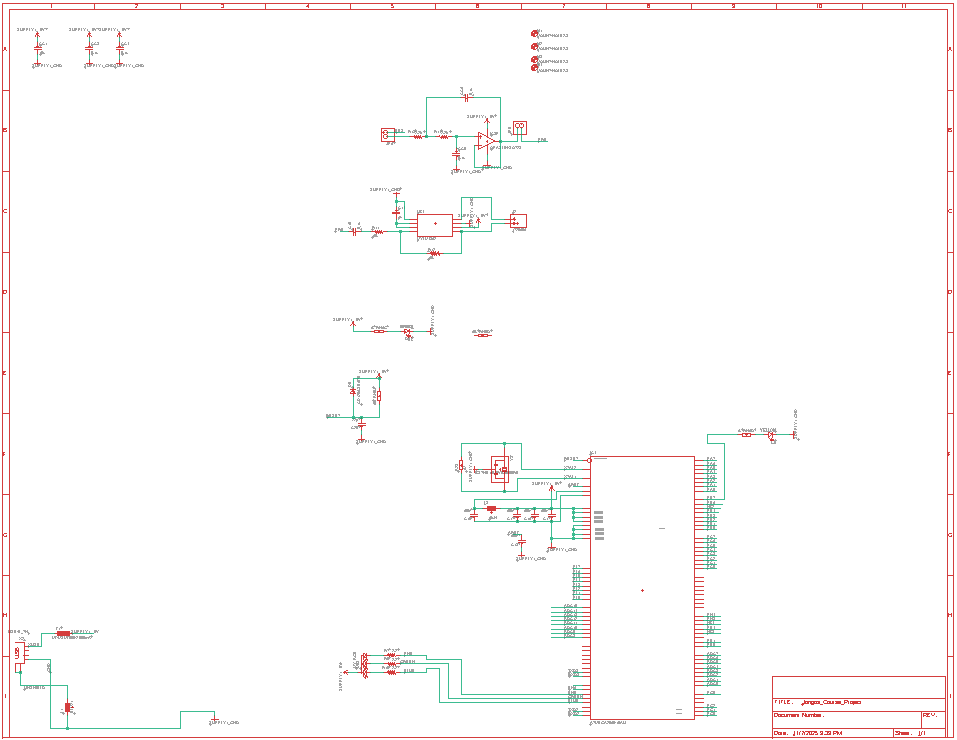
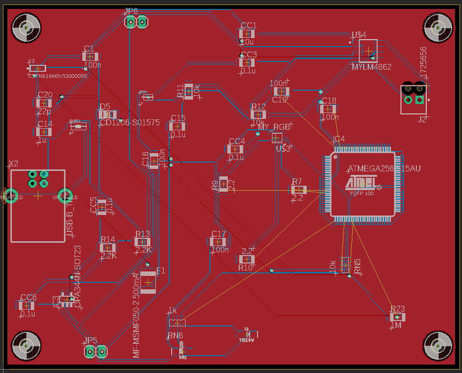

# Skyboard — Custom Arduino-Mega-Class PCB

A 4-layer Arduino-Mega-2560-class development board, designed from
scratch in **Eagle CAD** and exported as production-ready Gerbers.
The schematic mirrors the Arduino Mega 2560 reference design (ATmega2560
@ 16 MHz, USB-Serial via ATmega16U2, full pin breakout) with personal
touches around the power section, on-board sensors, and physical
form-factor.

<p align="center">

&nbsp;

</p>

The folder ships everything a fab needs — Gerbers, drill files, a
gerber job descriptor, and pick-and-place files for both sides — and
everything a reviewer needs to read the design — the original `.sch`
and `.brd`, full-resolution layout images with and without copper
pour, and a clean ERC report.

## What the board is

| Block | Implementation |
| --- | --- |
| MCU                  | ATmega2560-16AU (TQFP-100) |
| USB-Serial bridge    | ATmega16U2-MU (QFN-32) |
| Crystal              | 16 MHz fundamental, with 2 × 22 pF load caps |
| Power input          | 7-12 V DC barrel jack, reverse-polarity protected |
| Voltage regulation   | 5 V LDO + 3.3 V LDO, with bulk + bypass capacitance |
| User I/O             | full Arduino Mega header pinout (digital 0-53, analog 0-15, PWM, UART x4, I²C, SPI) |
| Status LEDs          | power, USB activity, pin-13, user |
| Reset                | tact switch + capacitor for auto-reset |

## What's in this folder

```
custom-mega-pcb/
├── schematic/
│   ├── skyboard.sch        # Eagle schematic
│   └── skyboard.brd        # Eagle board layout
├── gerbers/                # production-ready outputs
│   ├── copper_top.gbr            # signal + pour, top layer
│   ├── copper_bottom.gbr         # signal + pour, bottom layer
│   ├── silkscreen_top.gbr        # silkscreen, top
│   ├── silkscreen_bottom.gbr     # silkscreen, bottom
│   ├── soldermask_top.gbr
│   ├── soldermask_bottom.gbr
│   ├── solderpaste_top.gbr
│   ├── solderpaste_bottom.gbr
│   ├── profile.gbr               # board outline
│   ├── drill_1_16.xln            # NC drill file (Excellon)
│   ├── gerber_job.gbrjob         # PCBWay/JLC job descriptor
│   ├── PnP_top.txt               # pick-and-place, front
│   └── PnP_bottom.txt            # pick-and-place, back
└── docs/
    ├── schematic.png             # rendered schematic preview
    ├── layout.png                # 3-D-style render of the board
    ├── layout_with_copper.png    # 2-D layout with pour shown
    ├── layout_traces_only.png    # 2-D layout with pour hidden
    └── erc_clean.png             # Eagle ERC report passing
```

## How to fab it

The Gerbers in `gerbers/` are conformant with the
**JLCPCB / PCBWay / OSHPark** common file format.  Zip the folder and
upload it directly to the manufacturer of your choice; both `.gbrjob`
and the per-layer `.gbr` files match the de-facto naming convention
the cheap fabs expect.

For SMD assembly, the `PnP_*.txt` files give X / Y / rotation /
side / value / package for every component, suitable for direct
import into the JLC SMT-Assembly or PCBWay PCBA flow.

## Why this is a good portfolio piece

It's a **complete, manufacturable hardware artefact** — not a tutorial
you followed, not a layout you copied.  Three things in particular
worth pointing at:

- **A clean ERC.** The Eagle Electrical Rule Check passes without
  warnings — see `docs/erc_clean.png`.  In practice that means no
  unconnected nets, no overlapping components, no power/ground
  shorts that would show up the moment you applied 5 V.
- **A coherent ground pour.** The bottom layer (`copper_bottom.gbr`)
  is a single uninterrupted ground plane; the top layer
  (`copper_top.gbr`) carries signal traces and a partial 5 V pour.
  See `docs/layout_with_copper.png` vs `layout_traces_only.png` to
  compare.
- **Manufacturing-ready output.** Drill file is in metric Excellon
  format with the standard 1/16-inch step encoded.  Pick-and-place
  files match the layout one-to-one; no missing rotations or
  side flips.

## Why an Arduino-Mega clone, specifically?

The Mega 2560 is the right "max-out" target for an undergraduate
PCB project: it's a 100-pin TQFP (not impossible to hand-place but
more challenging than a 32-pin QFN), it has a separate USB-Serial
chip on-board (so you have to lay out *two* MCUs and route the
serial bridge between them), and the headers force you to commit to
a specific physical form factor — none of which you get from a
"blink an LED" two-sided breakout.

What I'd change for a v2:
- Move to KiCad — Eagle's library system is showing its age, and
  KiCad's Gerber-X3 export is cleaner.
- Replace the through-hole header strips with castellated edge
  pads, so the board can be reflowed onto a carrier without the
  manual Mega-shield pin-step.
- Add a USB-C connector with the CC-resistor termination, instead
  of the Mini-B that a Mega typically ships with.
